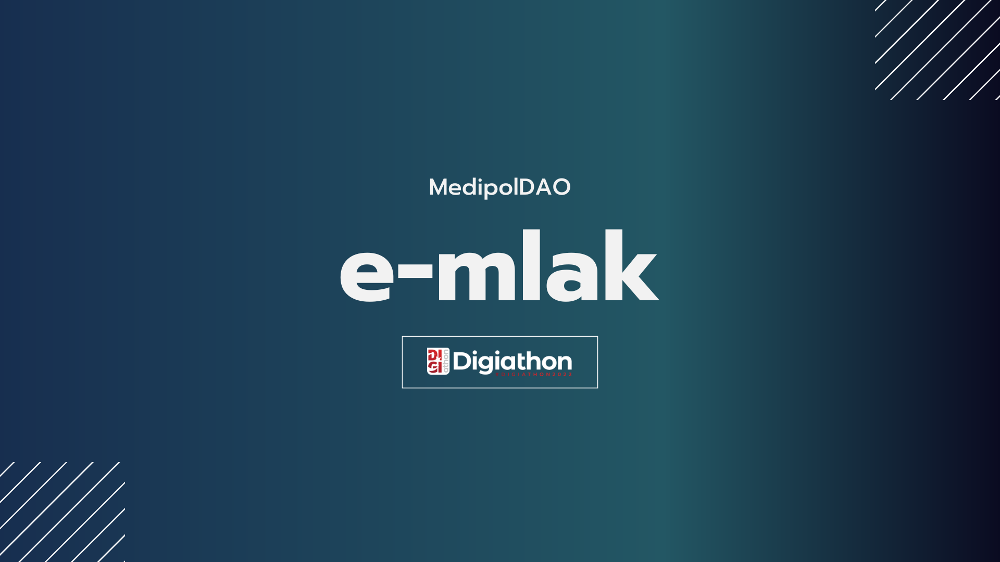
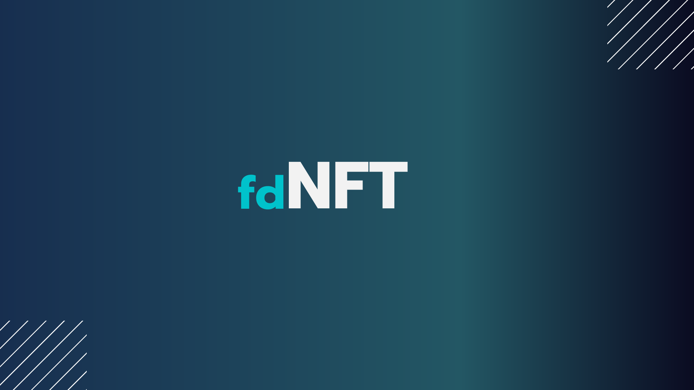
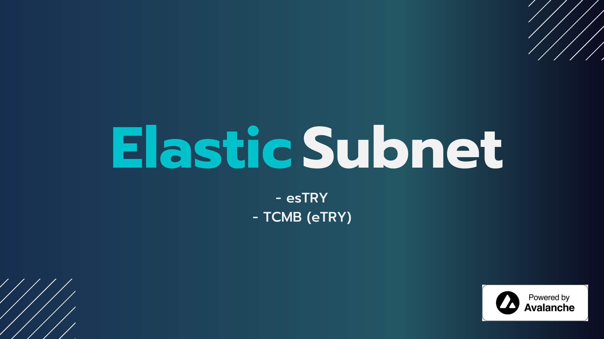
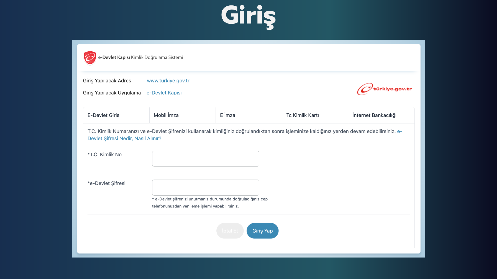
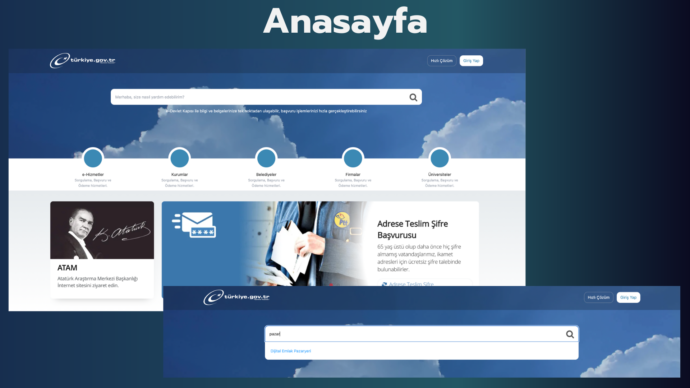
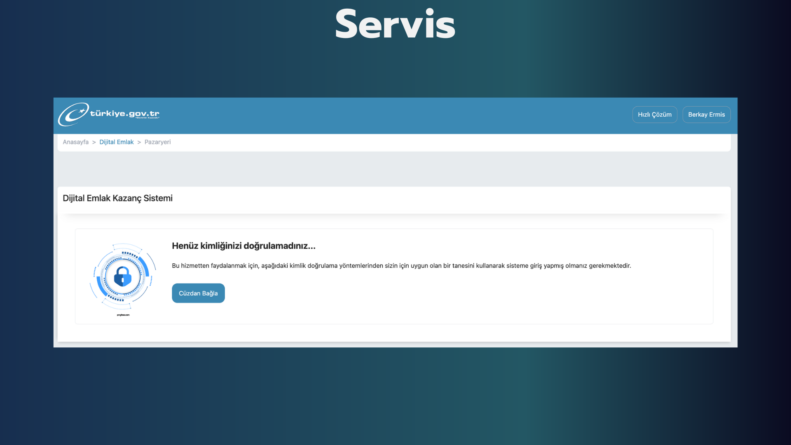
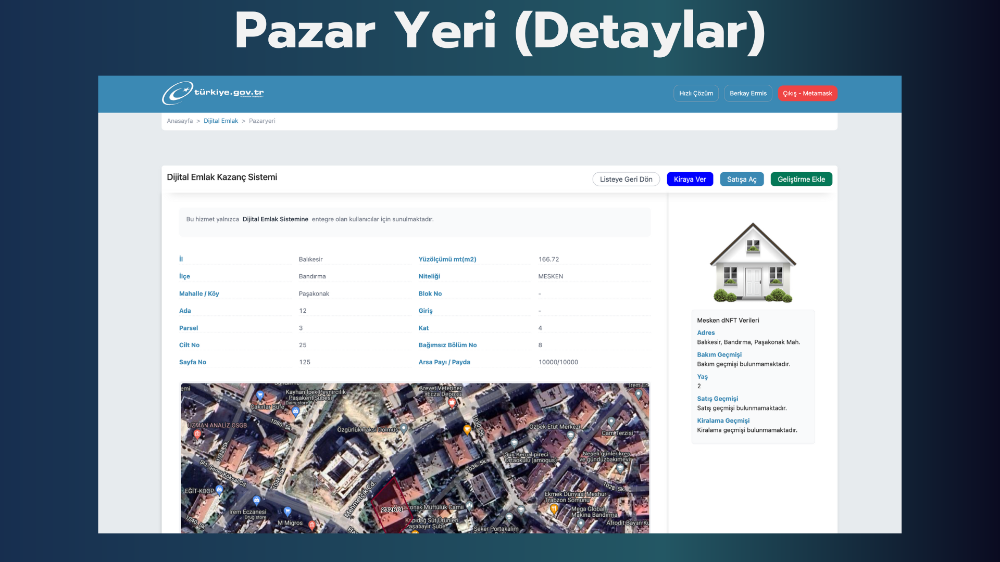
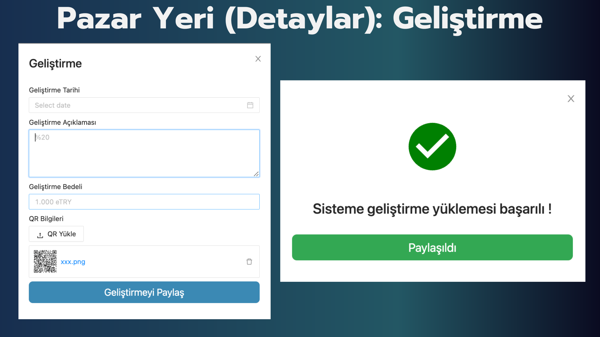
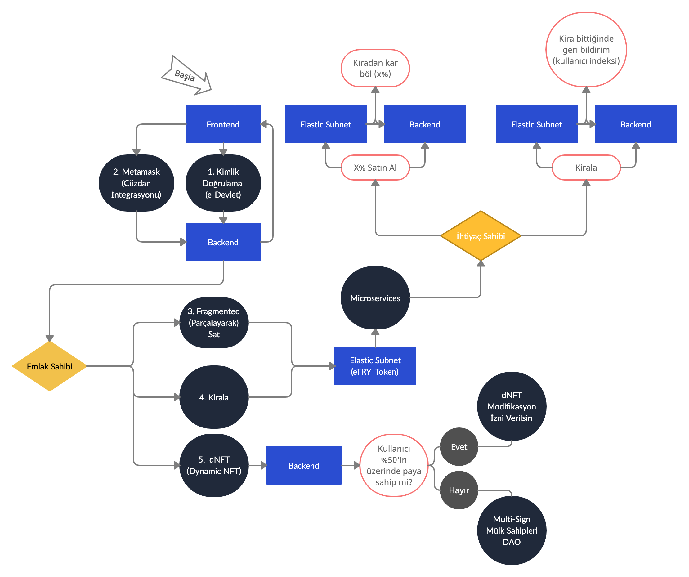

<div align="center">

</div>

<div align="center">


</div>
	
<h1>MedipolDAO Digiathon</h1>
<h4>E-Devlet ve Web3 cüzdan entegrasyonu ile Avalanche Elastic Subnet üzerinde paylaşılan akıllı kontrat ile emlak sahiplerini ve ihtiyaç sahiplerini buluşturarak DAO yapısı altında kazanç paylaşımı ve karar alma mekanizmalarını bir arada buluşturan emlak platformu. `E-mlak`-da, fahiş fiyatları ve fiyat manipülasyonları ile vergi kaçakçılığını şeffaf şekilde tüm operasyonları kullanıcılarla paylaşarak problemlerin çözümlenmesi hedeflenmiştir.</h4>
</div>

## [Sunum](https://www.canva.com/design/DAFR0pwKN-I/3CWiDtOk3EyAcLSjHN6BZg/view?utm_content=DAFR0pwKN-I&utm_campaign=designshare&utm_medium=link2&utm_source=sharebutton)
||||
| ------------- | ------------- | ------------- |
||||
||||
||||

- dNFT: Dynamic NFT
- fdNFT: Fragmented Dynamic NFT
- esTRY: Elastic Subnet TRY
- eTRY: 1 Liraya Sabit Dijital Token

## Kurulum
- [Backend](https://github.com/medipolchain/MedipolDAO-Digiathon-Backend)
- [Contracts](https://github.com/medipolchain/MedipolDAO-Digiathon-Contracts)

### Frontend
### Nodejs ve npm gereksinimleri
```shell
$ git clone https://github.com/medipolchain/MedipolDAO-Digiathon-Website.git

$ cd MedipolDAO-Digiathon-Website

$ npm i
```

### Backend
```shell
$ git clone https://github.com/medipolchain/MedipolDAO-Digiathon-Website.git

$ cd MedipolDAO-Digiathon-Backend

# A virtual environment is strongly recommended
$ pip install -r requirements.txt
```

### Akıllı Kontratlar
```shell
$ git clone https://github.com/medipolchain/MedipolDAO-Digiathon-Contracts.git

$ cd MedipolDAO-Digiathon-Contracts

$ npx hardhat help
$ npx hardhat test
$ REPORT_GAS=true npx hardhat test
$ npx hardhat node
$ npx hardhat run scripts/deploy.ts
```

## Klasör Yapısı
```shell
├── README.md
├── components
│   ├── breadcrumb
│   │   ├── index.js
│   │   └── styles.module.css
│   ├── home
│   │   ├── box.js
│   │   ├── header.js
│   │   ├── heroBlock.js
│   │   └── styles.module.css
│   ├── tabs
│   │   └── index.js
│   └── web3
│       ├── hooks
│       │   └── index.js
│       └── providers
│           ├── index.js
│           └── web3
│               ├── hooks
│               │   ├── setupHooks.js
│               │   ├── useAccount.js
│               │   └── useNetwork.js
│               └── index.js
├── contract
│   ├── abiAuction.json
│   ├── abiMarketplace.json
│   └── abiNFT.json
├── next.config.js
├── package-lock.json
├── package.json
├── pages
│   ├── _app.js
│   ├── giris
│   │   ├── index.js
│   │   └── styles.module.css
│   ├── index.js
│   └── pazaryeri
│       ├── index.js
│       ├── kiralik
│       │   └── [id].js
│       └── satis
│           └── [id].js
├── postcss.config.js
├── public
│   ├── bg.png
│   ├── favicon.ico
│   ├── sc.png
│   ├── screenshot.png
│   └── vercel.svg
├── styles
│   └── globals.css
├── tailwind.config.js
└── utils
    ├── axiosClient.js
    └── loadContract.js
```

## Akış diyagramı



## Takım üyeleri
[Berkay Ermiş - @berkayermis](https://github.com/berkayermis) - Full Stack

[Fetih Önal - @fetihonal](https://github.com/fetihonal) - Frontend

[Vusal Ismayilov - @woosal1337](https://github.com/woosal1337) - Backend

[Yusuf Benli - @yusufbenliii](https://github.com/yusufbenliii) - Smart Contracts / Security

## Lisans
[MIT](https://opensource.org/licenses/MIT): License
